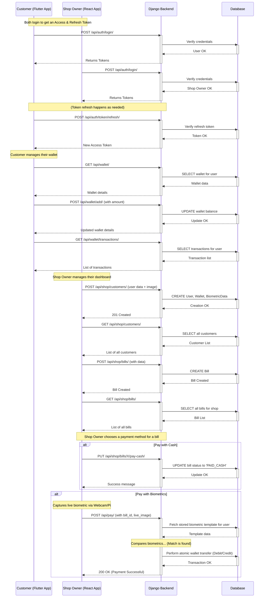

# VeinPay: Biometric Payment API

A Django REST Framework backend for a point-of-sale payment system using digital wallets, powered by biometric (face) authentication. This project serves as the complete server-side logic for a multi-frontend application (e.g., a Flutter app for customers and a React dashboard for shops).

## Features

* Digital Wallet System: Customers and shops have wallets with balance management.
* Role-Based Access: Distinct API endpoints and permissions for Customers and Shop Owners.
* Biometric Payment Flow: A secure payment process authenticated via facial recognition instead of a PIN.
* Modular Authentication: Includes a working proof-of-concept using OpenCV/Haar Cascades, with stubs for future integration of vein scanning or other methods.
* Token-Based Authentication: Uses JWT (JSON Web Tokens) for secure, stateless API communication.

## Tech Stack

* Backend: Django, Django REST Framework
* Database: PostgreSQL
* Authentication: SimpleJWT (JSON Web Tokens)
* Computer Vision: OpenCV
* Environment Management: python-decouple

## Project Setup

Instructions for a new developer to get the project running locally.

### 1. Prerequisites

* Python 3.10+
* PostgreSQL
* Git

### 2. Clone the Repository

```bash
git clone https://github.com/hameed-aliyar/vein-pay-backend.git
cd vein-pay-backend
```

### 3. Set Up the Environment

```bash
# Create and activate a virtual environment
python -m venv venv

# On Windows
venv\Scripts\activate

# On Mac/Linux
source venv/bin/activate

# Install required packages
pip install -r requirements.txt
```

### 4. Configure the Database

Create a new PostgreSQL database and a user with login privileges.
Create a `.env` file in the project root by copying the `.env.example` file.
Fill in your database credentials and a new Django SECRET_KEY in the `.env` file.

```env
SECRET_KEY=your_secret_key
DB_NAME=your_db_name
DB_USER=your_db_user
DB_PASSWORD=your_db_password
```

### 5. Run Migrations & Start the Server

```bash
# Apply database migrations
python manage.py migrate

# Create a superuser for the admin panel
python manage.py createsuperuser

# Run the development server
python manage.py runserver
```

The API is now running at [http://127.0.0.1:8000/](http://127.0.0.1:8000/).

---

## API Reference Guide

### Authentication

**Login (Get Token)**
Endpoint: `POST /api/auth/login/`
Body:

```json
{
    "username": "your_username",
    "password": "your_password"
}
```

Response: access and refresh tokens.

---

### Customer API (Authorization: Bearer <Customer_Token>)

* **Get Wallet Details**
  Endpoint: `GET /api/wallet/`

* **Add Funds to Wallet**
  Endpoint: `POST /api/wallet/add/`
  Body:

```json
{
    "amount": "100.50"
}
```

---

### Shop Owner API (Authorization: Bearer <Shop_Owner_Token>)

* **List/Create Customers**

  * Endpoint: `GET /api/shop/customers/` (to list)
  * Endpoint: `POST /api/shop/customers/` (to create)
    Body (for POST, multipart/form-data):

  ```text
  username: new_customer_name
  password: new_password
  biometric_type: FACE
  face_template: (File Upload)
  ```

* **List/Create Bills**

  * Endpoint: `GET /api/shop/bills/` (to list)
  * Endpoint: `POST /api/shop/bills/` (to create)
    Body (for POST):

  ```json
  {
      "customer": 12,
      "amount": "99.99"
  }
  ```

* **Mark Bill as Paid in Cash**
  Endpoint: `PUT /api/shop/bills/<id>/pay-cash/`

---

### Payment API (Authorization: Bearer <Shop_Owner_Token>)

* **Process Biometric Payment**
  Endpoint: `POST /api/pay/`
  Body (multipart/form-data):

  ```text
  bill_id: 1
  live_image: (File Upload of captured face)
  ```

Response: Success or failure message.

---

## Sequence Diagram



